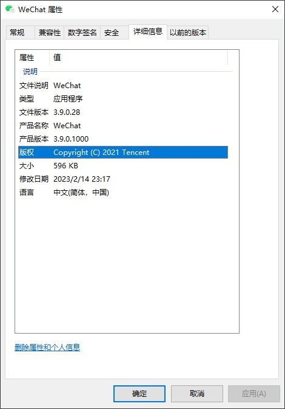

# Nuitka 版本元数据

## 什么是版本元数据

版本元数据就是用来描述二进制文件的信息，版本等数据的，例如下面在 Windows 上的属性截图，在不同的操作系统上都可以提供对可执行文件的元数据支持。

在 Nuitka 中，允许你进行二进制版本信息控制。

## 二进制版本信息

- `--company-name=COMPANY_NAME`  在版本信息中使用的公司名称。默认未使用。

- `--product-name=PRODUCT_NAME`  在版本信息中使用的产品名称。默认为二进制文件的基本文件名。

- `--file-version=FILE_VERSION`  在版本信息中使用的文件版本。必须是最多4个数字的序列，例如1.0或1.0.0.0，不允许更多的数字，也不允许字符串。默认未使用。

- `--product-version=PRODUCT_VERSION`  在版本信息中使用的产品版本。与文件版本的规则相同。默认未使用。

- `--file-description=FILE_DESCRIPTION`  在版本信息中使用的文件描述（目前仅在 Windows 上可用）。默认情况下为二进制文件名。

- `--copyright=COPYRIGHT_TEXT`  在版本信息中使用的版权信息（目前仅适用于 Windows）。默认未使用。

- `--trademarks=TRADEMARK_TEXT`  在版本信息中使用的商标信息（目前仅适用于 Windows）。默认未使用。

## Reference

[Nuitka the Python Compiler — Nuitka the Python Compiler documentation](https://nuitka.net/)
